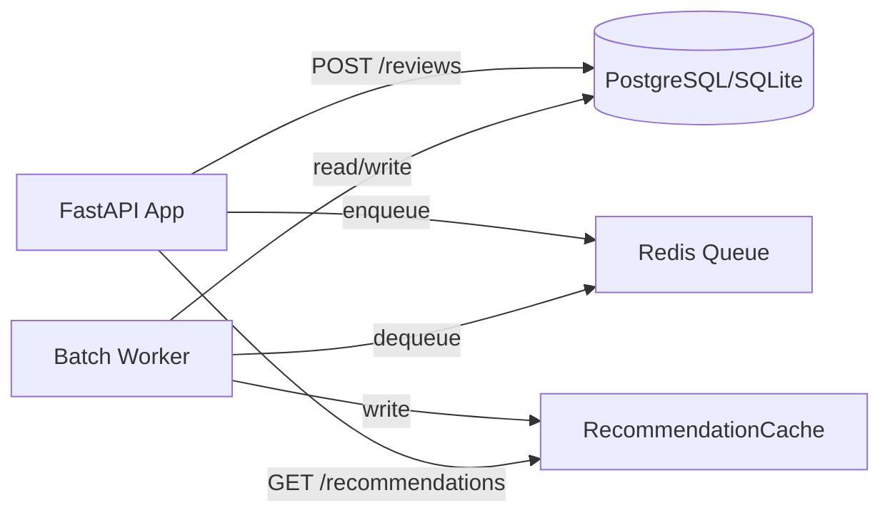

# Архитектура рекомендательного сервиса

## Цель
Сервис рекомендует книги на основе оценок пользователей. Пересчёт рекомендаций происходит асинхронно в батч-режиме, не блокируя основной API.

## Компоненты



## Детали компонентов

**FastAPI Application**
Основное веб-приложение обрабатывает пользовательские запросы. Использует dependency injection для управления подключениями к БД и очередями. Валидация входных данных через Pydantic-схемы обеспечивает типобезопасность и авто-документацию через OpenAPI.

**Database Layer**
SQLite. Можно перейти на Postgress. Три основные сущности:
- `User`/`Book`/`Author` — справочные данные
- `Review`/`ReadingEvent` — пользовательские действия с оценками
- `RecommendationCache` — предрассчитанные рекомендации (JSON-массив book_id + scores)

Индексы по `user_id`, `book_id` и `completed_at` ускоряют выборки для алгоритма.

**Task Queue**
Абстракция `TaskQueueProtocol` позволяет переключаться между:
- `InMemoryTaskQueue` — для тестов и локальной разработки
- `RedisTaskQueue` — для продакшена с гарантией доставки

Задача `recalculate_user` содержит минимальный контекст: `user_id`.

**Batch Worker**
Отдельный процесс, запускаемый через `python -m app.recommender`. Цикл:
1. Получает задачу из очереди
2. Загружает историю оценок пользователя и других пользователей
3. Строит user-item матрицу, вычисляет косинусное сходство
4. Фильтрует уже прочитанные книги, сортирует по скорингу
5. Сохраняет топ-N рекомендаций в кэш

Использует `numpy` для векторных операций.

**RecommendationCache**
Таблица-кэш с первичным ключом `user_id`. При запросе `/recommendations/{user_id}` API читает данные напрямую, без сложных JOIN. TTL не реализован — кэш обновляется при каждом новом событии.

## Поток данных

```
1. Пользователь ставит оценку → POST /reviews/
2. API сохраняет Review в БД
3. API отправляет задачу "recalculate_user:{id}" в очередь
4. Воркер забирает задачу, вычисляет новые рекомендации
5. Результат сохраняется в RecommendationCache
6. Следующий GET /recommendations/{id} возвращает актуальные данные
```

Важно: шаги 4–5 выполняются асинхронно. Пользователь получает ответ на шаг 1, не дожидаясь пересчёта.

## Выбор технологий

| Решение | Обоснование |
|---------|-------------|
| FastAPI | Асинхронность, авто-документация, типизация |
| SQLAlchemy | Абстракция над БД |
| Pydantic | Валидация данных, сериализация, интеграция с FastAPI |
| Redis | Быстрая очередь, атомарные операции, простота деплоя |
| numpy | Векторные вычисления для коллаборативной фильтрации |
| pytest + httpx | Интеграционное тестирование эндпоинтов |

## Стратегия тестирования

```
├── unit/
│   ├── test_schemas.py        # Валидация входных данных
│   └── test_recommender.py    # Логика расчёта сходства
├── integration/
│   ├── test_reviews_api.py    # Полный цикл: отзыв → очередь → кэш
│   └── test_recommendations_api.py  # Чтение из кэша
└── conftest.py                # Фикстуры: БД, клиент, очередь
```

Ключевые сценарии:
- Пользователь без истории → пустой список рекомендаций
- Новый отзыв → задача в очереди → кэш обновлён
- Конфликт уникальности (повторная оценка) → 400 ответ

Покрытие 80%.
Pylint 9.87.

## Развёртывание

**Локально**
```bash
# API
uv run uvicorn app.main:app --reload

# Воркер (отдельный терминал)
uv run python -m app.recommender

# Тесты
uv run pytest --cov=app
```

**Docker**
```bash
docker compose up --build
```

## Расширяемость

Архитектура позволяет:
- Добавить новый алгоритм: реализовать интерфейс `RecommenderEngine`
- Подключить контент-фильтрацию: расширить `RecommenderEngine` метаданными книг
- Ввести A/B-тестирование: добавить поле `algorithm_version` в кэш
- Перейти на периодический пересчёт всех пользователей: добавить задачу `recalculate_all` по расписанию

Ключевой принцип: разделение ответственности. API отвечает за быстрый ответ, воркер — за тяжёлые вычисления, очередь — за надёжную доставку задач между ними.